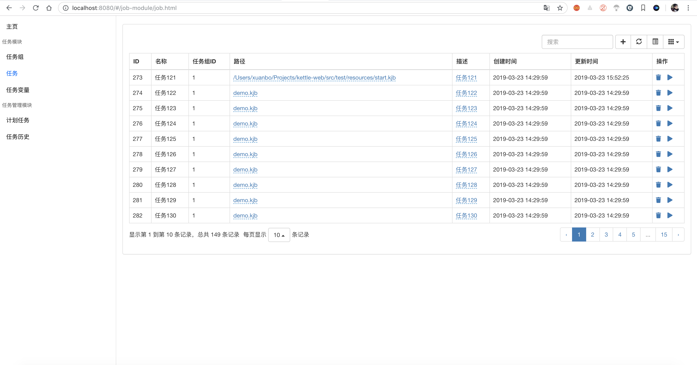
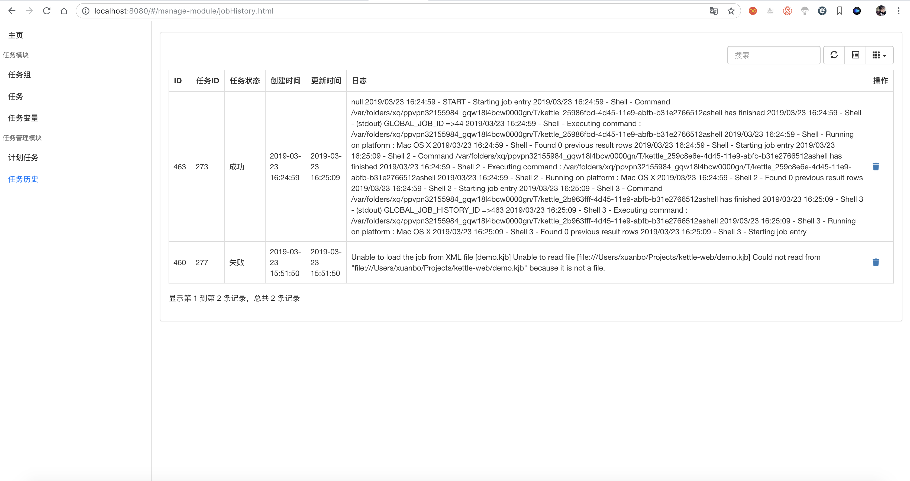
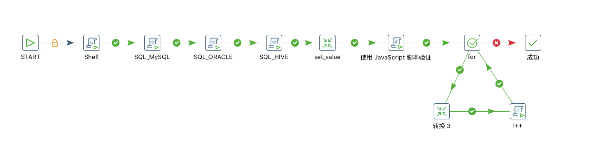

读我

> 通过Java API调用kettle核心代码，并基于Spring Boot提供简易的Web管理界面。

## 特点

* Java API调用Kettle核心代码
* 任务并行执行
* Web管理任务

## 展示

界面用Bootstrap3和jQuery简单撸了下。

### 任务

定义任务（目前需要指定kjb的路径），执行任务

### 任务历史

查看历史任务，看日志

## 已实现

* Java API调用Kettle核心代码（**基于Kettle 7.1**）
    * kjb调用ktr
    * Shell
    * MySQL
    * Oracle
    * Hive
    * JS代码
    * Java代码
    * Kettle其他功能暂未测试，目前测试覆盖的功能如下
      
* 任务并行执行
* Web管理任务
    * 任务监控dashboard
    * 任务组（分组管理）
    * 任务（任务定义，比如kjb路径）
    * 任务变量（将任务变量传入kjb，可在kjb中、或者ktr中获取到）
    * 任务历史（历史任务，任务执行日志）

## 暂未实现

* Web管理任务
    * 计划任务（定时调度）
    * 任务失败预警
    * 任务失败重试
    * 更美观、友好的界面
* 分布式任务执行、节点服务发现

## 说明

目前线上通过kitchen脚本调用kjb执行，当任务较多，导致资源浪费（每次执行都启动一个JVM实例）。因此，查找资料，通过Java API直接调用执行，并做了一个简易的Web管理，

**该系统暂未投入生产使用**，有想法的道友不妨在测试环境试试水，或者等发布稳定版。

## 快速开始

本项目为Spring Boot标准项目，clone到本地修改application.yml中的数据源配置即可。

### 项目结构

Spring Boot标准结构，利于二次开发。

### 运行

* 导入IDE，运行main方法
* 执行`mvn clean spring-boot:run`
* 打包`mvn package`，通过`java -jar target/kettle-web-{version}.jar`运行

## 关于开源

不足之处，请轻喷。欢迎志同道合的道友一起完善，谢谢～